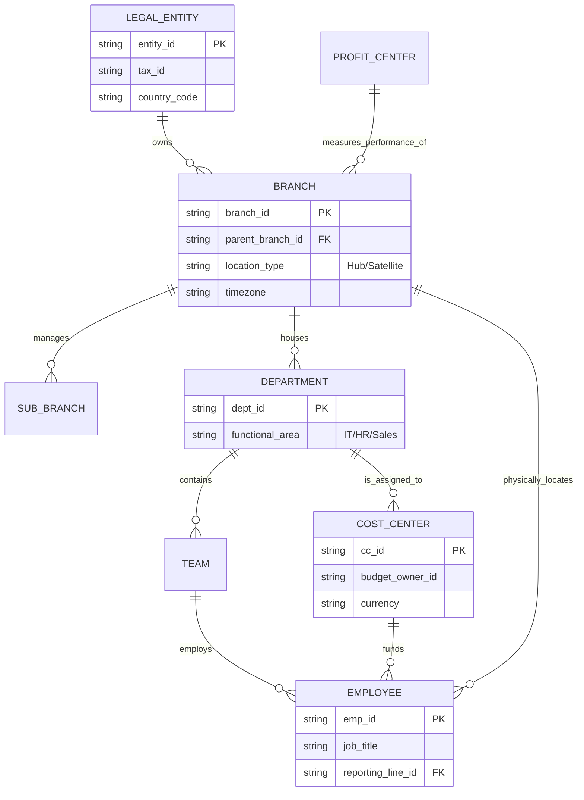

```mermaid
erDiagram
    LEGAL_ENTITY ||--o{ BRANCH : "owns"
    BRANCH ||--o{ SUB_BRANCH : "manages"
    BRANCH ||--o{ DEPARTMENT : "houses"
    
    PROFIT_CENTER ||--o{ BRANCH : "measures_performance_of"
    
    DEPARTMENT ||--o{ TEAM : "contains"
    DEPARTMENT ||--o{ COST_CENTER : "is_assigned_to"
    
    TEAM ||--o{ EMPLOYEE : "employs"
    COST_CENTER ||--o{ EMPLOYEE : "funds"
    BRANCH ||--o{ EMPLOYEE : "physically_locates"

    LEGAL_ENTITY {
        string entity_id PK
        string tax_id
        string country_code
    }
    BRANCH {
        string branch_id PK
        string parent_branch_id FK
        string location_type "Hub/Satellite"
        string timezone
    }
    DEPARTMENT {
        string dept_id PK
        string functional_area "IT/HR/Sales"
    }
    COST_CENTER {
        string cc_id PK
        string budget_owner_id
        string currency
    }
    EMPLOYEE {
        string emp_id PK
        string job_title
        string reporting_line_id FK
    }
```