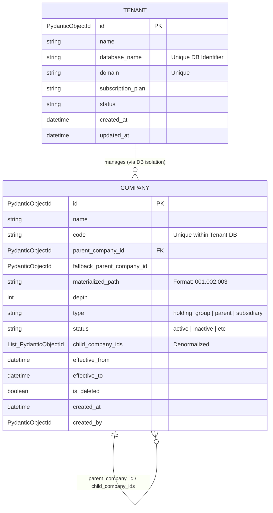

```mermaid
erDiagram
    TENANT ||--o{ COMPANY : "manages (via DB isolation)"
    COMPANY ||--o{ COMPANY : "parent_company_id / child_company_ids"
    
    TENANT {
        PydanticObjectId id PK
        string name
        string database_name "Unique DB Identifier"
        string domain "Unique"
        string subscription_plan
        string status
        datetime created_at
        datetime updated_at
    }

    COMPANY {
        PydanticObjectId id PK
        string name
        string code "Unique within Tenant DB"
        PydanticObjectId parent_company_id FK
        PydanticObjectId fallback_parent_company_id
        string materialized_path "Format: 001.002.003"
        int depth
        string type "holding_group | parent | subsidiary"
        string status "active | inactive | etc"
        List_PydanticObjectId child_company_ids "Denormalized"
        datetime effective_from
        datetime effective_to
        boolean is_deleted
        datetime created_at
        PydanticObjectId created_by
    }
```